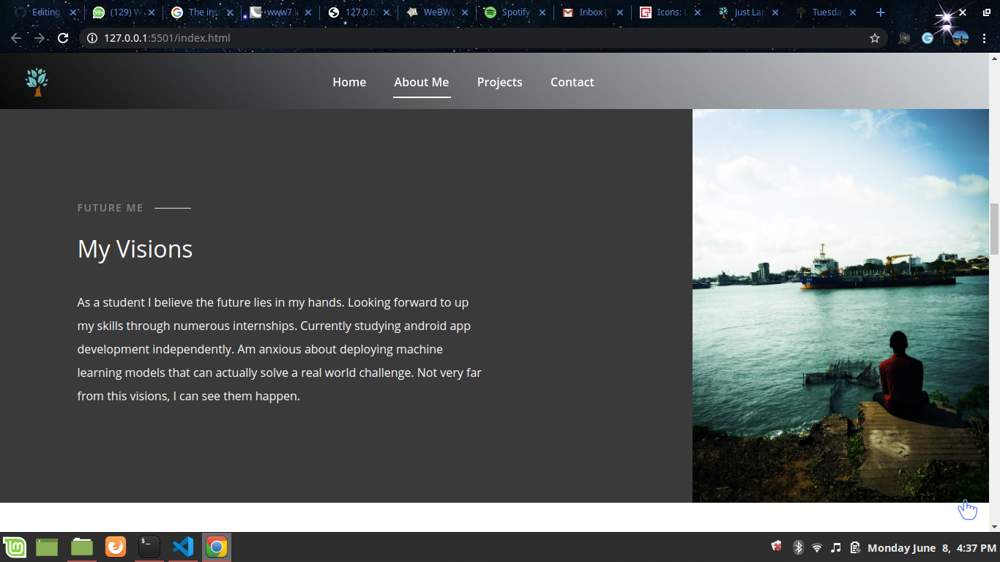

# Application Name
Just Lamech Landing Page. Check it out on this link ---> https://lamechy.github.io/Just_Lamech/

#### Brief description of application, date of current version
This is my landing page to guide my peers, collaborators and potential employers on the projects I'm working on.

## Date developed
08/06/2020

## Designer and Developer
Nyakundi Lamech

## Description

This landing page has:
- A brief intro and my resume
- My Vision: A summary of what I aspire to achieve
- My Projects that link to GitHub
- Just get about me.

## GUI

## Known Bugs

No known bugs currently but potential bugs are welcome to be reported.

## Technologies Used
**HTML**
**JavaScript**
**CSS**
**Bootstrap**
**JQuery**
**Fonts**
## Contact 
Am always available. Reach me via email: lamechongondi88@gmail.com

### License

